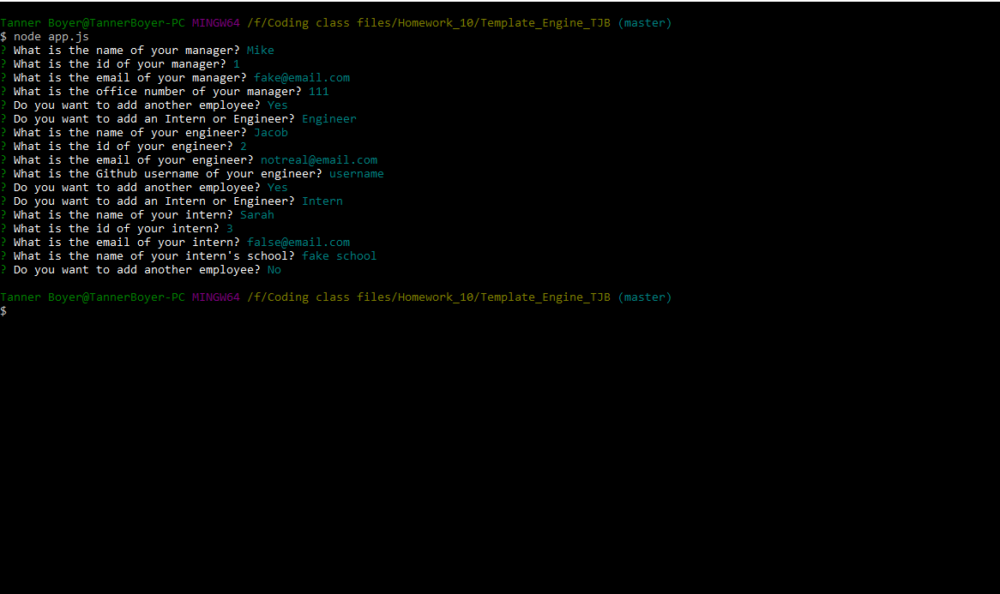
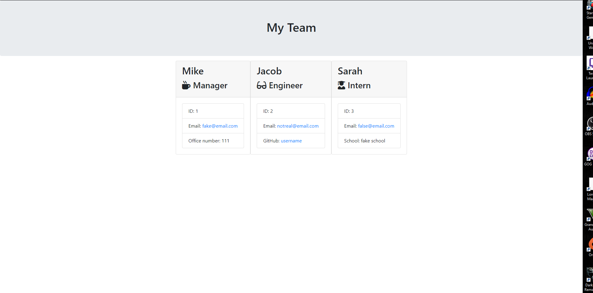

# Template_Engine_TJB




Video of application demo: [https://drive.google.com/file/d/1JW6JVeNpBPNKXWQf5Pdr21rtiMyaRWPg/view](https://drive.google.com/file/d/1JW6JVeNpBPNKXWQf5Pdr21rtiMyaRWPg/view)

## Description
```
This project is a command line application that lets you easily build your team through a series of prompts using inquirer.  The application will then take your answers
to the prompts and fill in the information in HTML page templates.  Afterward it will combine all the used templates in your finished website.
```

---
## Installation Instructions
To use this program you would be required to download/clone the repo.  When you have the files you need to run "npm install" to install the inquirer dependencies.

---
## Questions
For any questions contact me here:

GitHub: [TanJamBoy](https://github.com/TanJamBoy)

Email: [tannerjboyer@gmail.com](tannerjboyer@gmail.com)

---